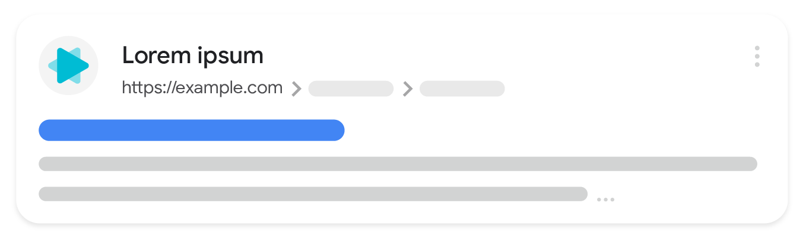
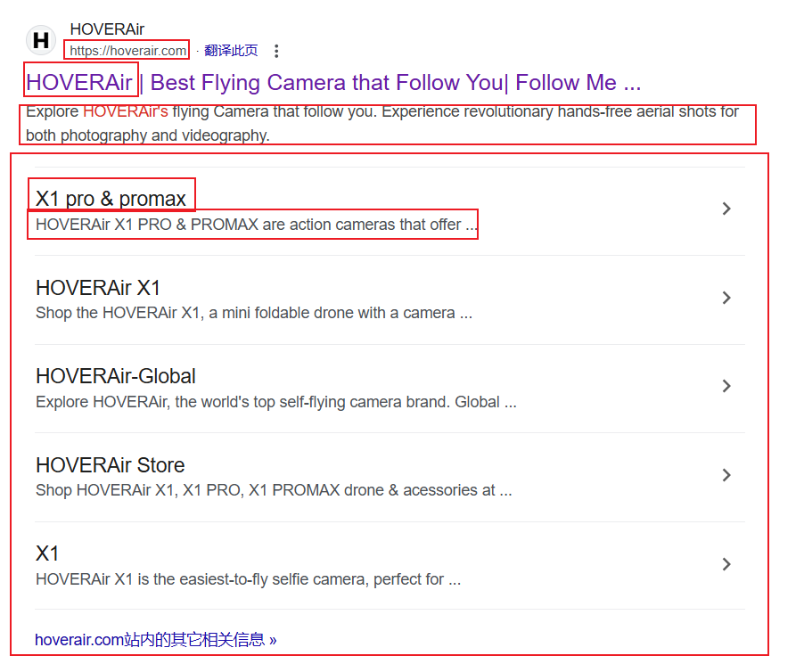

# SEO优化

> 作者: `@SouthAki`
>
> 文档开源协议: `GPL-3.0`

> 引用Google的搜索引擎优化指南:[点击访问](https://developers.google.com/search/docs/fundamentals/seo-starter-guide?hl=zh-cn)

## 概念

通过优化页面的内容,结构化为搜索引擎提供更好的抓取数据的机会



搜索引擎是通过爬虫(Google是Google Bot)，流程如下

### 1. **网页发现 (Crawling)**

Googlebot 爬虫首先通过多个渠道发现网页，主要通过以下几种方式：

- **外部链接 (Backlinks)**: Googlebot通过访问一个网页上的外部链接来发现新页面。当其他网站链接到你的网站时，Googlebot 会通过这些链接爬取相关页面。
- **站点地图 (Sitemaps)**: 如果网站提供了 XML 格式的站点地图，Googlebot 可以直接读取这些地图，快速了解网站的页面结构。
- **页面内链接**: 当 Googlebot 访问网站时，它会遵循网页上的所有内部链接来抓取其他页面。
- **RSS 和其他动态内容**: 通过订阅 RSS 源或其他内容源，Googlebot 也可以发现新页面或更新的内容。

注意:**谷歌对于spider的爬取时长是有限的，对于网页性能更好的网站，爬的速度就越快，意味着爬取的内链（外链）就越多，因此网页性能至关重要，这就引出我们的SSR服务端渲染技术，毕竟爬虫不会等你把页面渲染完再获取数据iframe！之前了解到我们网站对于某些特殊组件在shopify中不好实现，选择在站外用其他框架实现，并用iframe把这部分嵌进去，这对SEO来说是一个很糟糕的选择，因为spider ***\*完全不会\**** 去爬iframe里的信息.当然spider不会一直频繁的访问网站对商户服务器增加压力，会做一定算法的处理，比如碰到http500的情况会降低抓取的频率，这对SEO无疑是一个大的打击因此，尤其注意避免死链的发生，确保页面内的链接都是有效的最后就是确保页面结构合规，在碰到spider不识别的tag会立即停止爬取，当然这种情况在目前的技术下很少发生**

### 2. **抓取 (Fetching)**

抓取是指 Googlebot 获取网页内容的过程。Googlebot 通过模拟用户访问网站的方式，获取网页的 HTML 内容。具体过程如下：

- **访问网页**: Googlebot 会发送 HTTP 请求访问目标网页。

- 获取网页内容

  : 一旦服务器响应，Googlebot 将解析网页的 HTML 代码，并开始抓取页面中的内容。

  - **解析 HTML**: 解析网页中的文本、图片、链接等资源。
  - **加载资源**: Googlebot 会根据需要加载网页上的 CSS、JavaScript、图片等外部资源。这个过程取决于网站是否通过 JavaScript 动态加载内容。

### 3. **解析和渲染 (Rendering)**

Googlebot 会根据抓取到的 HTML 文件以及其他资源（如 JavaScript 和 CSS）进行解析和渲染。这是确保 Googlebot 能够理解网页内容并根据内容排名的关键步骤。

- **解析 HTML 和 CSS**: Googlebot 将对 HTML 和 CSS 文件进行解析，以确定网页的布局和内容。

- 执行 JavaScript

  : 对于现代网站，Googlebot 还会执行网页中的 JavaScript，以确保动态加载的内容也能被正确抓取。Googlebot 的“渲染”引擎会模拟浏览器的行为，从而加载动态内容（例如通过 AJAX 获取的内容）。

  - 如果网页内容通过 JavaScript 动态加载，Googlebot 需要等待 JavaScript 执行完成才能获取页面的最终内容。

### 4. **索引 (Indexing)**

一旦 Googlebot 获取并渲染网页，它将对网页内容进行索引。索引是将网页内容存储在 Google 的数据库中的过程，以便以后能够快速查询。Googlebot 会将网页上的内容（如文本、标题、图片等）以及页面的链接信息存入索引数据库。

- **分析内容**: Googlebot 会分析网页的文本、关键字、标题、图片、链接等内容，以了解页面的主题。

  > 注意: **在这个过程中，遇到相似的页面，spider会把这些页面归类为一个聚类，好比把这些页面归为一个小组，这时候我们需要选一下谁当代表被检索（Canonical），用来优选抓取数据这在一种情况下尤其重要，比如 hoverair.com 和 www.hoverair.com 会被spider识别为两个不同的网站，但实际上就是一个页面。这时我们就要做好网址规范化，配置好Canonical，防止重复收录，导致SEO流量的分散！！**

- **处理元数据**: Google 会提取网页中的元数据（如 `<meta>` 标签、`<title>` 标签、`alt` 属性等）来帮助确定页面的主题和相关性。

- **识别和处理重复内容**: 如果网页存在重复内容（例如相同的文章在多个 URL 上显示），Googlebot 会识别并处理这些情况，避免重复索引。

- **内容存储**: 爬取并分析后，Google 会将页面内容存入索引系统，并为其生成一个独特的标识符（即索引 ID）。

### 5. **排名 (Ranking)**

在 Google 的搜索引擎中，网页的排名是根据多个算法因素来决定的。这些因素包括网页的相关性、页面内容、页面的质量、用户体验等。Google 的排名算法会使用从抓取和索引步骤中收集到的信息来为每个查询生成一个搜索结果页面。

- **PageRank**: Google 最初的排名算法基于链接分析，即通过网页之间的链接（链接的质量和数量）来判断页面的权威性。
- **内容相关性**: Googlebot 会评估网页内容的相关性，如关键词是否出现在页面中、页面是否解决了用户的查询需求。
- **用户体验**: 页面加载速度、移动端友好性、广告内容等都会影响排名。

### 6. **更新和再抓取 (Re-crawling and Refreshing)**

网页的内容经常会发生变化，Googlebot 会定期重新抓取和更新网页内容。Google 会根据不同页面的重要性和更新频率来调整抓取的频率。

- **频繁更新的页面**: 比如新闻网站或社交媒体平台，Googlebot 会更频繁地抓取这些页面，以确保内容是最新的。
- **不常更新的页面**: 例如静态页面或低流量页面，Googlebot 会较少访问这些页面。

### 7. **展现搜索结果 (Serving Search Results)**

在用户搜索时，Google 会根据已索引的页面内容、排名算法等因素，为用户提供最相关的搜索结果。Google 会根据每个页面的综合评分（包括其相关性、质量等）来决定其在搜索结果中的排名。

### 8. **反馈与优化**

Googlebot 会不断优化自己的抓取算法、页面渲染能力和索引效率。Google 还会根据搜索趋势、用户行为等反馈，调整搜索结果排名。

## 指标(重要配置)

### 1. **Meta**

> 什么是meta标签：
>
> HTML 的元数据标签，提供网页的描述、关键字、作者等信息。嵌入在页面的 `<head>` 部分，专门给spider提供网站信息

### 2. **TDK**

> TDK就是早期最原始的一个SEO优化，对应网站的 `Title Description KeyWord`
>
> keyword据说之前网站都在乱加已经削弱了SEO影响，目前基本上不去考虑这个点

### 3. **Lang**

> 对各国用户做适配,提升网站全球的优先级

### 4. **Sitemap**

> 顾名思义就是站点地图，用来告诉spider我这个网站有哪些你需要爬取的链接，crawding阶段spider会像个游客拿着你的站点地图依次打卡你的网页里的链接
>
> 是一个xml文件，包含了每个网页的链接（loc），更新时间（lastmod），权重（priority）权重的范围为0~1，一般主页就是1，其他页面按重要性递减，或者看情况
>
> 

### 5. **Robots.txt**

给爬虫下指令的文本文件,能让其合理地抓取网站内资源，而且可以将网站不重要的内容屏蔽，从而抓取更多有价值高质量的内容和网页，提高网站排名。

不过这个是一个君子协议,正规爬虫会严格遵守这个协议,但是不一定所有爬虫遵守

下面举个例子

```text
User-agent: *
Disallow: /search
Allow: /search/about
Allow: /search/static
Allow: /search/howsearchworks
Disallow: /sdch
Disallow: /groups
Disallow: /index.html?
Disallow: /?
Allow: /?hl=
Disallow: /?hl=*&
Allow: /?hl=*&gws_rd=ssl$
Disallow: /?hl=*&*&gws_rd=ssl
Allow: /?gws_rd=ssl$
Allow: /?pt1=true$
Disallow: /imgres
Disallow: /u/
Disallow: /setprefs
Disallow: /default
Disallow: /m?
Disallow: /m/
Allow:    /m/finance
Disallow: /wml?
Disallow: /wml/?
Disallow: /wml/search?
Disallow: /xhtml?
Disallow: /xhtml/?
Disallow: /xhtml/search?
Disallow: /xml?
Disallow: /imode?
Disallow: /imode/?
Disallow: /imode/search?
Disallow: /jsky?
Disallow: /jsky/?
Disallow: /jsky/search?
Disallow: /pda?
Disallow: /pda/?
Disallow: /pda/search?
Disallow: /sprint_xhtml
Disallow: /sprint_wml
Disallow: /pqa
Disallow: /gwt/
Disallow: /purchases
Disallow: /local?
Disallow: /local_url
Disallow: /shihui?
Disallow: /shihui/
Disallow: /products?
Disallow: /product_
Disallow: /products_
Disallow: /products;
Disallow: /print
Disallow: /books/
Disallow: /bkshp?*q=*
Disallow: /books?*q=*
Disallow: /books?*output=*
Disallow: /books?*pg=*
Disallow: /books?*jtp=*
Disallow: /books?*jscmd=*
Disallow: /books?*buy=*
Disallow: /books?*zoom=*
Allow: /books?*q=related:*
Allow: /books?*q=editions:*
Allow: /books?*q=subject:*
Allow: /books/about
Allow: /booksrightsholders
Allow: /books?*zoom=1*
Allow: /books?*zoom=5*
Allow: /books/content?*zoom=1*
Allow: /books/content?*zoom=5*
Disallow: /ebooks/
Disallow: /ebooks?*q=*
Disallow: /ebooks?*output=*
Disallow: /ebooks?*pg=*
Disallow: /ebooks?*jscmd=*
Disallow: /ebooks?*buy=*
Disallow: /ebooks?*zoom=*
Allow: /ebooks?*q=related:*
Allow: /ebooks?*q=editions:*
Allow: /ebooks?*q=subject:*
Allow: /ebooks?*zoom=1*
Allow: /ebooks?*zoom=5*
Disallow: /patents?
Disallow: /patents/download/
Disallow: /patents/pdf/
Disallow: /patents/related/
Disallow: /scholar
Disallow: /citations?
Allow: /citations?user=
Disallow: /citations?*cstart=
Allow: /citations?view_op=new_profile
Allow: /citations?view_op=top_venues
Allow: /scholar_share
Disallow: /s?
Disallow: /maps?
Allow: /maps?*output=classic*
Allow: /maps?*file=
Disallow: /mapstt?
Disallow: /mapslt?
Disallow: /mapabcpoi?
Disallow: /maphp?
Disallow: /mapprint?
Disallow: /maps/
Allow: /maps/search/
Allow: /maps/dir/
Allow: /maps/d/
Allow: /maps/reserve
Allow: /maps/about
Allow: /maps/match
Disallow: /maps/api/js/
Allow: /maps/api/js
Disallow: /mld?
Disallow: /staticmap?
Disallow: /help/maps/streetview/partners/welcome/
Disallow: /help/maps/indoormaps/partners/
Disallow: /lochp?
Disallow: /center
Disallow: /ie?
Disallow: /blogsearch/
Disallow: /blogsearch_feeds
Disallow: /advanced_blog_search
Disallow: /uds/
Disallow: /chart?
Disallow: /transit?
Allow:    /calendar$
Allow:    /calendar/about/
Disallow: /calendar/
Disallow: /cl2/feeds/
Disallow: /cl2/ical/
Disallow: /coop/directory
Disallow: /coop/manage
Disallow: /trends?
Disallow: /trends/music?
Disallow: /trends/hottrends?
Disallow: /trends/viz?
Disallow: /trends/embed.js?
Disallow: /trends/fetchComponent?
Disallow: /trends/beta
Disallow: /trends/topics
Disallow: /trends/explore?
Disallow: /trends/embed
Disallow: /trends/api
Disallow: /musica
Disallow: /musicad
Disallow: /musicas
Disallow: /musicl
Disallow: /musics
Disallow: /musicsearch
Disallow: /musicsp
Disallow: /musiclp
Disallow: /urchin_test/
Disallow: /movies?
Disallow: /wapsearch?
Allow: /safebrowsing/diagnostic
Allow: /safebrowsing/report_badware/
Allow: /safebrowsing/report_error/
Allow: /safebrowsing/report_phish/
Disallow: /reviews/search?
Disallow: /orkut/albums
Disallow: /cbk
Disallow: /recharge/dashboard/car
Disallow: /recharge/dashboard/static/
Disallow: /profiles/me
Allow: /profiles
Disallow: /s2/profiles/me
Allow: /s2/profiles
Allow: /s2/oz
Allow: /s2/photos
Allow: /s2/search/social
Allow: /s2/static
Disallow: /s2
Disallow: /transconsole/portal/
Disallow: /gcc/
Disallow: /aclk
Disallow: /cse?
Disallow: /cse/home
Disallow: /cse/panel
Disallow: /cse/manage
Disallow: /tbproxy/
Disallow: /imesync/
Disallow: /shenghuo/search?
Disallow: /support/forum/search?
Disallow: /reviews/polls/
Disallow: /hosted/images/
Disallow: /ppob/?
Disallow: /ppob?
Disallow: /accounts/ClientLogin
Disallow: /accounts/ClientAuth
Disallow: /accounts/o8
Allow: /accounts/o8/id
Disallow: /topicsearch?q=
Disallow: /xfx7/
Disallow: /squared/api
Disallow: /squared/search
Disallow: /squared/table
Disallow: /qnasearch?
Disallow: /app/updates
Disallow: /sidewiki/entry/
Disallow: /quality_form?
Disallow: /labs/popgadget/search
Disallow: /buzz/post
Disallow: /compressiontest/
Disallow: /analytics/feeds/
Disallow: /analytics/partners/comments/
Disallow: /analytics/portal/
Disallow: /analytics/uploads/
Allow: /alerts/manage
Allow: /alerts/remove
Disallow: /alerts/
Allow: /alerts/$
Disallow: /ads/search?
Disallow: /ads/plan/action_plan?
Disallow: /ads/plan/api/
Disallow: /ads/hotels/partners
Disallow: /phone/compare/?
Disallow: /travel/clk
Disallow: /travel/entity
Disallow: /travel/search
Disallow: /travel/flights/s/
Disallow: /travel/hotels/entity
Disallow: /travel/hotels/stories
Disallow: /hotelfinder/rpc
Disallow: /hotels/rpc
Disallow: /commercesearch/services/
Disallow: /evaluation/
Disallow: /chrome/browser/mobile/tour
Disallow: /compare/*/apply*
Disallow: /forms/perks/
Disallow: /shopping/suppliers/search
Disallow: /ct/
Disallow: /edu/cs4hs/
Disallow: /trustedstores/s/
Disallow: /trustedstores/tm2
Disallow: /trustedstores/verify
Disallow: /adwords/proposal
Disallow: /shopping?*
Disallow: /shopping/product/
Disallow: /shopping/seller
Disallow: /shopping/ratings/account/metrics
Disallow: /shopping/ratings/merchant/immersivedetails
Disallow: /shopping/reviewer
Disallow: /shopping/search
Disallow: /shopping/deals
Disallow: /storefront
Disallow: /storepicker
Allow: /about/careers/applications/
Allow: /about/careers/applications-a/
Allow: /about/careers/applications/teams/
Allow: /about/careers/applications-a/teams/
Allow: /about/careers/applications/locations/
Allow: /about/careers/applications-a/locations/
Allow: /about/careers/applications/benefits/
Allow: /about/careers/applications-a/benefits/
Allow: /about/careers/applications/students/
Allow: /about/careers/applications-a/students/
Allow: /about/careers/applications/jobs/results/$
Allow: /about/careers/applications-a/jobs/results/$
Allow: /about/careers/applications/cloud/
Allow: /about/careers/applications-a/cloud/
Allow: /about/careers/applications/hardware/
Allow: /about/careers/applications-a/hardware/
Allow: /about/careers/applications/eeo/
Allow: /about/careers/applications-a/eeo/
Allow: /about/careers/applications/how-we-hire/
Allow: /about/careers/applications-a/how-we-hire/
Allow: /about/careers/applications/interview-tips/
Allow: /about/careers/applications-a/interview-tips/
Disallow: /about/careers/applications/
Disallow: /about/careers/applications-a/
Disallow: /about/careers/applications/jobs/results?page=
Disallow: /about/careers/applications/jobs/results/?page=
Disallow: /about/careers/applications/jobs/results?*&page=
Disallow: /about/careers/applications/jobs/results/?*&page=
Disallow: /landing/signout.html
Disallow: /webmasters/sitemaps/ping?
Disallow: /ping?
Disallow: /gallery/
Disallow: /landing/now/ontap/
Allow: /searchhistory/
Allow: /maps/reserve
Allow: /maps/reserve/partners
Disallow: /maps/reserve/api/
Disallow: /maps/reserve/search
Disallow: /maps/reserve/bookings
Disallow: /maps/reserve/settings
Disallow: /maps/reserve/manage
Disallow: /maps/reserve/payment
Disallow: /maps/reserve/receipt
Disallow: /maps/reserve/sellersignup
Disallow: /maps/reserve/payments
Disallow: /maps/reserve/feedback
Disallow: /maps/reserve/terms
Disallow: /maps/reserve/m/
Disallow: /maps/reserve/b/
Disallow: /maps/reserve/partner-dashboard
Disallow: /about/views/
Disallow: /intl/*/about/views/
Disallow: /local/cars
Disallow: /local/cars/
Disallow: /local/dealership/
Disallow: /local/dining/
Disallow: /local/place/products/
Disallow: /local/place/reviews/
Disallow: /local/place/rap/
Disallow: /local/tab/
Disallow: /localservices/*
Allow: /finance
Allow: /js/
Disallow: /nonprofits/account/
Disallow: /uviewer
Disallow: /landing/cmsnext-root/

# AdsBot
User-agent: AdsBot-Google
Disallow: /maps/api/js/
Allow: /maps/api/js
Disallow: /maps/api/place/js/
Disallow: /maps/api/staticmap
Disallow: /maps/api/streetview

# Crawlers of certain social media sites are allowed to access page markup when google.com/imgres* links are shared. To learn more, please contact images-robots-allowlist@google.com.
User-agent: Twitterbot
Allow: /imgres
Allow: /search
Disallow: /groups
Disallow: /hosted/images/
Disallow: /m/

User-agent: facebookexternalhit
Allow: /imgres
Allow: /search
Disallow: /groups
Disallow: /hosted/images/
Disallow: /m/

# Explicit rules for common LLM bots that might not attribute source data.
User-agent: anthropic-ai
User-agent: Applebot-Extended
User-agent: Bytespider
User-agent: CCBot
User-agent: ChatGPT-User
User-agent: ClaudeBot
User-agent: cohere-ai
User-agent: Diffbot
User-agent: FacebookBot
User-agent: GPTBot
User-agent: ImagesiftBot
User-agent: Meta-ExternalAgent
User-agent: Meta-ExternalFetcher
User-agent: Omgilibot
User-agent: PerplexityBot
User-agent: Timpibot
Disallow: /maps*

Sitemap: https://www.google.com/sitemap.xml
```

### 6. **网址规范化**

> 啥叫网址规范化？其实就是整理你自己的域名，不要东一个西一个，分散自己的流量，SEO的核心之一就是权重集中
>
> 比如官网:
>
> - xxx.com
> - www.xxx.com
>
> 明明就是一个页面,但是是两个不同的地址,spider会将两个都编入索引,导致重复收录
>
> 如何避免?
>
> 1. 设置`canonical`,跟前面所说
> 2. 设置301重定向,来进行权重转移,以为每个域名都是有谷歌做一个权重评估的 `PageRank-网页级别`
>
> 什么时候应该做重定向
>
> 1. 路径修改了,老链接一定要重定向到新链接
> 2. 已经被删除的死链,被导向404去的链接

### 7. **结构化数据**

> 结构化数据就是能做搜索排行中看到你当前网页的一些信息，帮助搜索引擎做优化，以及展示更多信息给搜索者
>
> 以下就是个例子，把代码买入对应的head就能立刻生效了
>
> ```js
> <script type="application/ld+json">
> 
> ​    {
> 
> ​     "@context": "https://schema.org",
> 
> ​     "@type": "NewsArtice",
> 
> ​     "headline": "Title of a News Article",
> 
> ​     "image": [
> 
> ​      "https://example.com/photos/1x1/photo.jpg",
> 
> ​      "https://example.com/photos/4x3/photo.jpg",
> 
> ​      "https://example.com/photos/16x9/photo.jpg"
> 
> ​     ],
> 
> ​     "datePublished": "2015-02-05T08:00:00+08:00",
> 
> ​     "dateModified": "2015-02-05T09:20:00+08:00",
> 
> ​     "author": [{
> 
> ​       "@type": "Person",
> 
> ​       "name": "Jane Doe",
> 
> ​       "url": "https://example.com/profile/janedoe123"
> 
> ​      },{
> 
> ​       "@type": "Person",
> 
> ​       "name": "John Doe",
> 
> ​       "url": "https://example.com/profile/johndoe123"
> 
> ​     }]
> 
> ​    }
> 
> </script>
> ```

### 8. **Open Graph协议**

> 就是一种meta标签,可以看到在meta数据中看到*OG:*的东西
>
> `Facebook`发布的一种可以在主流社交平台预览网页数据的一种协议,可以让你不仅仅在浏览器,在其他app上也可以看到分享的链接数据

### 9. **内链,外链**

> ***\*内链\****：从自己网站的一个页面指向另外一个页面。通过内链让网站内部形成网状结构，让spider爬取最大化。
>
> ***\*外链\****：在别的网站导入自己网站的链接。通过外链提升网站权重，提高网站流量。
>
> 1. 提升网站的权重
> 2. 能够吸引蜘蛛来爬取网站
> 3. 提高关键词排名
> 4. 提升网址或者品牌的曝光度
> 5. 给网站带来流量
>
> ```html
> <a rel="nofollow" href="http://www.hoverair.com/">哈浮</a>
> 
> <a rel="external" href="http://hoverair.com/">哈浮</a>
> ```
>
> 

## 优化

### 优化页面结构

> 从标签入手,尽量参考大厂的标准,或者通过MDN

### 语义化标签

> `header`,`main`,`footer`,`section`等

### 替换对纯图片组件以及Iframe组件

## 检测

只能通过seo流量证明有效性