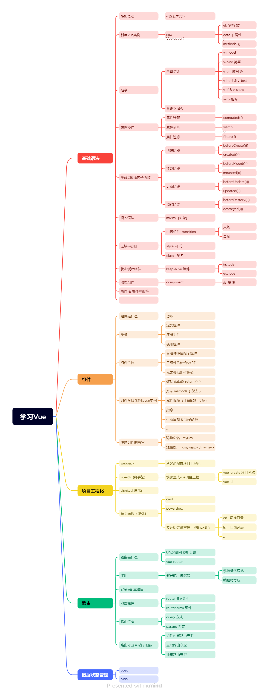

# Vue2

> 作者:@SouthAki

## 是什么

> Vue.js:渐进式[^1] JavaScript 框架 一个用于构建 Web 用户界面的平易近人、高性能且多功能的框架。数据双向绑定MVVM框架**(M:model数据模型,V:view数据视图,VM:view modelVue的实例)**

本文会讲到:组件,生命周期,组件传值,路由,路由导航,路由守卫,状态管理,vuex,脚手架工具,依次推进

Vue2版本的数据响应式实现方式:`Object.defineProperty(对象,属性,{写入回调,读取回调})`



## 为什么要使用Vue

1. 减少繁琐的DOM操作
2. 数据响应式,让开发者更加关注业务逻辑的处理
3. 提高开发效率
4. 拥有完整的生态(声明式编程,组件,路由,数据状态管理,脚手架等)

## 怎么使用

1. 采用原生Vue的方式(通过script引入Vue文件)
2. 构建web项目工程(webpack vue-cli vite)

## 基础语法

命令式编程和声明式编程的区别

> 命令式注重过程,声明式注重结果
>
> ```javascript
> // 命令式
> let btn = document.querySelector('.btn');
> btn.onclick = function(){
>     console.log("点击了");
> };
> 
> // 声明式
> <div id="app">
>     <input type="text" v-model="val">
>     <button @click="search">查询</button>
> </div>
> new vue({
>     el:"app",
>     data:{val:""},
>     search(){
>         let keyword = this.val
>     }
> })
> ```

### 首次使用

引入Vue文件

```http
https://fastly.jsdelivr.net/gh/southaki/contentDeliveryNetwork@0.0.8/Vue/Vue@2/vue2.js
```

设置挂载容器

```html
<body>
    <div id= 'app'>
        
    </div>
</body>
<script>
	const vm = new Vue({
        // 设置挂载点
        el:"#app",
        // 存储数据
        // data:{}
        data(){
            return{
                msg:""
            }
        }
    })
</script>
```

Vue中表示变量的方式是用`{{}}`的方式

### 模版语法

> 写在挂载容器下的都是模版

### 指令

> 指令是一种操作DOM的快捷方式

```text
数据双向绑定: v-model
渲染超文本: v-html
渲染纯文本: v-text
属性绑定: v-bind 简写 :
事件绑定: v-on 简写 @
条件渲染: v-show v-if
列表渲染: v-for
```

### 属性计算,属性侦听,属性过滤

这里要加入点新东西:如何防止抖动或者出现`{{}}`

```html
<style>
    [v-cloak]{
        display: none;
    }
</style>
<div id="#app" v-cloak>
    <!-- 这里的v-cloak: 使用原生Vue代码开发项目的时候,防止出现抖动或者出现{{}}-->
</div>
```

通过以上的配置,可以实现防抖动,数据会等渲染完毕再展示

属性计算:`computed`这个关键字,是对象来的

```javascript
computed:{
	// 返回一个函数
}
```

属性侦听:`watch`这个关键字对象

```javascript
watch:{
    // 返回一个函数做判断啊之类的
}
```

记得,浅层的值比较可以直接比较,对一个变量进行监听

```javascript
data:{
    id:"xxxx"
},
watch:{
	id(newId,oldId){
        // 进行判断
    }  
}
```

但是深层的比较,比如数据和对象,要进入里面的话

```javascript
deep:true //开启深度
```

属性过滤:

> 针对属性做一些格式化的操作或保留指定格式数据的操作
>
> ```javascript
> // 需要在上面的容器里使用管道
> // {{xxx | yyy}} xxx:代表要过滤前的属性,yyy是过滤的方法
> // 设置属性过滤
> new Vue({
>     // 前面配置略
>     filter:{
>         //过滤器名称: value参数是上面管道传递的参数
>         yyy(value){
>             return fn() || 方法; // 返回你想返回的
>         }
>     }
> })
> ```

### 事件绑定

事件修饰符:

`@keydown.enter='fn()'`表示按下回车后执行函数的意思

`@click.prevent`表示阻止默认行为

### 组件

> 组件:项目的一个模块/功能.(可以重复使用)
>
> 步骤:
>
> 1. 定义组件
> 2. 注册组件
> 3. 使用组件

组件有两种:`全局组件`和`局部组件`

全局组件:

```javascript
// 组件:HTML+CSS+JavaScript组件的功能模块.相当于小型的Vue示例
//data只能返回的是函数,不能是对象,因为要重复的使用,所以必须函数
// 标签名不能作为组件名称 例如:header,nav,footer,main,aside等这些标签名称

// 语法:Vue.component(组件名称,选项对象)
Vue.component('Search',{
    data(){
        return{
            msg:'消息',
        }
    },
    template:`
    	<h3>{{msg}}</h3>
    `
})
```

局部组件:

```javascript
// 在new实例对象的时候声明
// 荔枝:
new Vue({
    el:'#app',
    // 局部组件
    commponents:{
        // 组件名:
        xxx:{
            data(){},
            template:``
        }
    }
})
```

### 组件传值

#### 父组件传值给子组件

```javascript
// 父传子
// 1. 子组件Child中的props选项中定义属性
// 2. 在父组件模版中使用子组件<Child :属性='值'></Child>
// 初始化
const vm = new Vue({
    el: '#app',
    // 注册组件
    components:{
        'Parent':{
            template:``,
            components:{
                'Child':{
                    // 自定义属性接收父组件传递的值
                    // props:['num']
                    props:{
                        num:{
                            type:Number // 定义数据类型
                        }
                    },
                    template:``
                }
            }
        }
    }
})
```

#### 子组件传值给父组件

```javascript
// 子组件传值给父组件
// 是反向传值,需要 事件 来实现
// 步骤:
// 1. 在子组件中通过编写this.$emit(xxx,数据)自定义事件的方法(send)
// 2. 在子组件中调用这个send,可以通过点击事件或者使用生命周期的方式来实现
// 3. 在父组件中使用自定义事件 例如: <Child @xxx='recv'></Child>
// 4. 父组件中定义这个方法recv 用于接收子组件传递的值
// 下面是一个示例
// 初始化
const vm = new Vue({
    // 设置挂载点
    el: '#app',
    // 注册组件
    components:{
        'parent':{
            template:``,
            data(){
                return num: ''
            },
            methods:{
                recv(value){
                    // 定义方法接收子组件传递的值
                    this.num = value;
                }
            },
            components:{
                "Child":{
                    template:``,
                    methods:{
                        // 利用this.$emit()这个方法发送数据给父组件
                        send(){
                            // 定义时间名称
                            // this.$emit(事件名称,值)
                            this.$emit("xxx",xxxxxxx)
                        }
                    },
                    // 初始化
                    created(){
                        // 调用send方法
                        this.send();
                    }
                }
            }
        }
    }
})
```

#### 兄弟组件传值

```javascript
// 步骤:
// 1.创建一个Vue示例作为通信桥梁
// 2.利用这个示例调用$emit自定义事件的名称
// 3.利用这个实例调用$on监听事件触发
// 4.通过监听事件触发,获取传递的值

// 创建通信的桥梁
const brigde = new Vue();
// 初始化
new Vue({
    el: '#app',
    components:{
        // 组件一
        "Brother":{
            template:``,
            methods:{
                sendfn(){
                    brigde.$emit('xxxx',xxxxx)
                }
            },
            // 生命周期调用
            created(){
                // 发送数据
                setTimeout(()=>{
                    this.sendfn();
                },10)
            }
        },
        'Sister':{
            template:``,
            data(){
                return{
                    num: ''
                }
            },
            created(){
                brigde.$on('xxxx',(value)=>{
                    this.num = value;
                })
            }
        }
    }
})
```


### 生命周期


> 是指的是Vue程序或者组件从创建到销毁的这个过程

> 不同阶段可以调用不同的钩子函数
>
> 初始化可以在created(){}
>
> 操作DOM可以在mounted(){}

**四个阶段**:

1. *创建阶段*
2. *挂载阶段*
3. *更新阶段*
4. *销毁阶段*

**八个钩子**:

1. *创建阶段*:`beforeCreate`,`created`
2. *挂载阶段*:`beforeMount`,`mounted`
3. *更新阶段*:`beforeUpdate`,`updated`
4. *销毁阶段*:`beforeDestroy`,`destoyed`

#### 详解

世间万物都有自己生命周期⏱，vue也有这一特点，vue的生命周期可以简单分为四个阶段：创建阶段，挂载阶段，运行阶段，销毁阶段。

每个 Vue 实例在被创建时都要经过一系列的初始化过程——例如，需要设置数据监听、编译模板、将实例挂载到 DOM 并在数据变化时更新 DOM 等。

> ❝
>
> 在这个过程中会运行一些叫做生命周期钩子的函数，这给了用户在不同阶段添加自己的代码的机会。
>
> ❞

每个阶段都有两个生命周期钩子函数。

- 创建阶段--beforeCreate，created
- 挂载阶段--beforeMount，mounted
- 运行阶段--beforeUpdate，updated
- 销毁阶段--beforeDestroy，destroyed

> ❝
>
> 所有的生命周期钩子自动绑定 this 上下文到实例中，因此你可以访问数据，对 property 和方法进行运算。这意味着你不能使用箭头函数来定义一个生命周期方法 (例如 created: () => this.fetchTodos())。这是因为箭头函数绑定了父上下文，因此 this 与你期待的 Vue 实例不同，this.fetchTodos 的行为未定义。
>
> ❞

下面来分别介绍一下这几个阶段 Vue 帮我们做了什么。然后我们又能在不同阶段做些什么。

## 创建阶段

创建阶段可以看做一个vue实例生命的开始，可以把这一阶段比作组件从受精卵到胚胎的过程，这个阶段 vue组件开始初始化，vue开始观察数据，这个阶段有 beforeCreate 和 created 两个生命周期钩子函数。

### beforeCreate

`beforeCreate`：是new Vue()之后触发的第一个钩子，此时 data、methods、computed以及watch上的数据和方法还未初始化，都不能被访问。

> ❝
>
> 在实例初始化之后，数据观测 (data observer) 和 event/watcher 事件配置之前被调用。
>
> ❞

### created

`created`：在实例创建完成后被立即调用，此时已完成以下的配置：数据观测 (data observer)，property 和方法的运算，watch/event 事件回调。然而，挂载阶段还没开始，$el property 目前尚不可用，也就是可以使用数据，更改数据，在这里更改数据不会触发updated函数。

可以做什么：

- data 和 methods 都已经被初始化好了，如果要调用 methods 中的方法，或者操作 data 中的数据，最早可以在这个阶段中操作。
- 无法与Dom进行交互，如果非要想，可以通过vm.$nextTick来访问Dom。
- 异步数据的请求适合在 created 的钩子中使用，例如数据初始化。

## 挂载阶段

这个阶段是vue实例的出生阶段，这个阶段将实现 DOM 的挂载，这标志着我们可以在浏览器里中看到页面了。

### beforeMount

`beforeMount`：发生在挂载之前，在这之前 template 模板已导入渲染函数编译。此时虚拟Dom已经创建完成，即将开始渲染。在这一阶段也可以对数据进行更改，不会触发updated。

> ❝
>
> 执行到这个钩子的时候，在内存中已经编译好了模板了，但是还没有挂载到页面中，此时，页面还是旧的。
>
> ❞

### mounted

`mounted`：在挂载完成后发生，此时真实的Dom挂载完毕，数据完成双向绑定，可以访问到Dom节点，使用$refs属性对Dom进行操作。

> ❝
>
> 执行到这个钩子的时候，就表示vue实例已经初始化完成了。此时组件脱离了创建阶段，进入到了运行阶段。 如果我们想要通过插件操作页面上的DOM节点，最早可以在和这个阶段中进行。
>
> ❞

「注意」：mounted 不会保证所有的子组件也都一起被挂载。如果你希望等到整个视图都渲染完毕，可以在 mounted 内部使用 vm.$nextTick。

```javascript
mounted: function () {
  this.$nextTick(function () {
    // Code that will run only after the
    // entire view has been rendered
  })
}
```

## 运行阶段

vue实例不可能一直保持不变，就像人随着年龄的增长，形体会发生变化。当vue实例中的数据发生改变时，DOM 也会发生变化。

### beforeUpdate

`beforeUpdate`：发生在更新之前，也就是响应式数据发生更新，虚拟dom重新渲染之前被触发，你可以在当前阶段进行更改数据，不会造成重新渲染,但会再次触发当前钩子函数。

### updated

`updated`：发生在更新完成之后，此时 Dom 已经更新。现在可以执行依赖于 DOM 的操作。然而在大多数情况下，你应该避免在此期间更改状态。如果要相应状态改变，最好使用计算属性或 watcher 取而代之。最好不要在此期间更改数据，因为这可能会导致无限循环的更新。

「注意」：updated 不会保证所有的子组件也都一起被重绘。如果你希望等到整个视图都重绘完毕，可以在 updated 里使用 vm.$nextTick。

```javascript
updated: function () {
  this.$nextTick(function () {
    // Code that will run only after the
    // entire view has been re-rendered（代码将在整个视图重新渲染后执行）
  })
}
```

## 销毁阶段

vue实例的消亡阶段。实例还可以被使用，直到destroyed(),我们可以最后做一些想做的事情。

### beforeDestroy

`beforeDestroy`：发生在实例销毁之前，在这期间实例完全可以被使用，我们可以在这时进行善后收尾工作，比如清除计时器。

> ❝
>
> Vue实例从运行阶段进入到了销毁阶段，这个时候上所有的 data 和 methods ， 指令， 过滤器 ……都是处于可用状态。还没有真正被销毁。
>
> ❞

### destroyed

`destroyed`：发生在实例销毁之后，这个时候只剩下了dom空壳。组件已被拆解，数据绑定被卸除，事件监听器被移除，所有子实例也统统被销毁。

> ❝
>
> 在大多数场景中你不应该调用这个方法。最好使用 v-if 和 v-for 指令以数据驱动的方式控制子组件的生命周期。
>
> ❞

| 生命周期      | 实例处于阶段 | 描述                                                         | 能否获取到`el(this.el)` | 能否获取到`data(this.$el)` | 能否使用`methods`中的方法 `(this.xxx())` |
| ------------- | ------------ | ------------------------------------------------------------ | ----------------------- | -------------------------- | ---------------------------------------- |
| beforeCreate  | 创建前       | 实例已初始化，但数据观测，watch/event 事件回调还未配置       | 获取不到                | 不能                       | 不能                                     |
| created       | 创建后       | 已完成如下配置，数据观测 (data observer)，property 和方法的运算，watch/event 事件回调 | 获取不到                | 能                         | 能                                       |
| beforeMount   | 挂载前       | dom已初始化，但并未挂载和渲染                                | 能                      | 能                         | 能                                       |
| mounted       | 挂载后       | dom已完成挂载和渲染                                          | 能                      | 能                         | 能                                       |
| beforeUpdate  | 更新前       | 数据已改变，但dom为更新                                      | 能                      | 能                         | 能                                       |
| updated       | 更新后       | dom已更新                                                    | 能                      | 能                         | 能                                       |
| beforeDestroy | 销毁前       | 实例销毁前，实例仍然可用                                     | 能                      | 能                         | 能                                       |
| destroyed     | 销毁后       | 实例已销毁，所有指令被解绑，事件监听器被移除，子实例都被销毁 | 能                      | 能                         | 能                                       |


### 过渡/动画

> 可以直接使用CSS3的`tranforms`或者`animation`

也可以使用Vue的组件:`transition`(内置组件)


要搭配`style.css`

```css
.v-enter{
    
}
.v-enter-to{
    
}
.v-enter-active{
    
}

.v-leave{
    
}
.-v-leave-to{
    
}
.v-leave-active{
    
}
```

如果有重复出现的`transition`,要起一个`name`

```html
<transition>
	<组件 v-if='布尔值'></组件>
</transition>
```

### 混入(代码复用)

```javascript
// 定义对象(组件A和组件B都可以使用以下的选项)
// 混入对象
const options = {
    data(){
        return{
            
        }
    },
    methods:{
        show(){
            
        }
    }
}
new Vue({
    el: '#app',
    components:{
        "MyCompa":{
            // 当组件和混入对象含有同名选项,这些选项将以恰当的方式进行合并
            // 比如,数据对象在内部会进行递归合并,并发生冲突的时候以组件数据优先
            mixins:[options],
            data(){
                return {}
            },
            template:``
        },
        "MyCompb":{
            mixins:[options],
            data(){
                return {
                    
                }
            },
            template:``
        }
    }
})
```

### 自定义指令

```javascript
const vm = new Vue({
    el: '#app',
    // 自定义指令
    directives:{
        // 定义一个名,使用的时候,请在前面加上v-xxx
        // 比如我定义一个名,叫color,使用的时候,使用v-color
        color(el,binding){
            // el是dom对象
            // binding是参数对象
            // 比如我们可以这样
            el.style[`backgroundColor`] = binding.value
        },
        
        xxx(el,binding){
            // 也可以结构赋值
            let {a,b} = binding.modifiers;
            let val = binding.value;
        }
    }
})
// 主要给程序员提供扩展dom操作方法
```

### 路由传参

> 一共有四种方法

1. `router-link`
	```javascript
	1. 不带参数
	 
	<router-link :to="{name:'home'}"> 
	<router-link :to="{path:'/home'}"> //name,path都行, 建议用name  
	// 注意：router-link中链接如果是'/'开始就是从根路由开始，如果开始不带'/'，则从当前路由开始。
	 
	 
	 
	2.带参数
	 
	<router-link :to="{name:'home', params: {id:1}}">  
	 
	// params传参数 (类似post)
	// 路由配置 path: "/home/:id" 或者 path: "/home:id" 
	// 不配置path ,第一次可请求,刷新页面id会消失
	// 配置path,刷新页面id会保留
	 
	// html 取参  $route.params.id
	// script 取参  this.$route.params.id
	 
	 
	<router-link :to="{name:'home', query: {id:1}}"> 
	 
	// query传参数 (类似get,url后面会显示参数)
	// 路由可不配置
	 
	// html 取参  $route.query.id
	// script 取参  this.$route.query.id
	```
	
2. `this.$router.push() (函数里面调用)`

	```javascript
	1.  不带参数
	 
	this.$router.push('/home')
	this.$router.push({name:'home'})
	this.$router.push({path:'/home'})
	 
	 
	 
	2. query传参 
	 
	this.$router.push({name:'home',query: {id:'1'}})
	this.$router.push({path:'/home',query: {id:'1'}})
	 
	// html 取参  $route.query.id
	// script 取参  this.$route.query.id
	 
	 
	 
	3. params传参
	 
	this.$router.push({name:'home',params: {id:'1'}})  // 只能用 name
	 
	// 路由配置 path: "/home/:id" 或者 path: "/home:id" ,
	// 不配置path ,第一次可请求,刷新页面id会消失
	// 配置path,刷新页面id会保留
	 
	// html 取参  $route.params.id
	// script 取参  this.$route.params.id
	 
	 
	 
	4. query和params区别
	query类似 get, 跳转之后页面 url后面会拼接参数,类似?id=1, 非重要性的可以这样传, 密码之类还是用params刷新页面id还在
	 
	params类似 post, 跳转之后页面 url后面不会拼接参数 , 但是刷新页面id 会消失
	```

	

3. `this.$router.replace() (用法同上,push)`
4. `this.$router.go(n)`

> 其中有几点区别
>
> - `this.$router.push`
> 	跳转到指定url路径，并想history栈中添加一个记录，点击后退会返回到上一个页面
> - `this.$router.replace`
> 	跳转到指定url路径，但是history栈中不会有记录，点击返回会跳转到上上个页面 (就是直接替换了当前页面)
> - `this.$router.go(n)`
> 	向前或者向后跳转n个页面，n可为正整数或负整数


### 路由守卫

> 路由守卫也是钩子函数
>
> 做拦截用(比如在加入购物车前判断有没有登录,有再跳转)


### 面试题

#### `v-show`和`v-if`区别

当是`false`两者都不会占据页面位置

但是两者的控制手段不同,编译过程不同,编译条件不同

`v-show`隐藏是为该元素添加`css:display:none;`,dom元素还是存在于dom文档流里,但是`v-if`是让dom元素直接整个删除或删除

`v-show`原理:

```javascript
// https://github.com/vuejs/vue-next/blob/3cd30c5245da0733f9eb6f29d220f39c46518162/packages/runtime-dom/src/directives/vShow.ts
export const vShow: ObjectDirective<VShowElement> = {
  beforeMount(el, { value }, { transition }) {
    el._vod = el.style.display === 'none' ? '' : el.style.display
    if (transition && value) {
      transition.beforeEnter(el)
    } else {
      setDisplay(el, value)
    }
  },
  mounted(el, { value }, { transition }) {
    if (transition && value) {
      transition.enter(el)
    }
  },
  updated(el, { value, oldValue }, { transition }) {
    // ...
  },
  beforeUnmount(el, { value }) {
    setDisplay(el, value)
  }
}
```

`v-if`原理:

```javascript
// https://github.com/vuejs/vue-next/blob/cdc9f336fd/packages/compiler-core/src/transforms/vIf.ts
export const transformIf = createStructuralDirectiveTransform(
  /^(if|else|else-if)$/,
  (node, dir, context) => {
    return processIf(node, dir, context, (ifNode, branch, isRoot) => {
      // ...
      return () => {
        if (isRoot) {
          ifNode.codegenNode = createCodegenNodeForBranch(
            branch,
            key,
            context
          ) as IfConditionalExpression
        } else {
          // attach this branch's codegen node to the v-if root.
          const parentCondition = getParentCondition(ifNode.codegenNode!)
          parentCondition.alternate = createCodegenNodeForBranch(
            branch,
            key + ifNode.branches.length - 1,
            context
          )
        }
      }
    })
  }
)
```

## 开发项目中移动端适配

### 步骤

```text
## 移动端适配和加后缀
一、amfe-flexible
1. 首先把安装amfe-flexible包
npm i  amfe-flexible -S

2. 配置 postcss-pxtorem
postcss-pxtorem会将px转换为rem
rem单位用于适配不同宽度的屏幕
根据标签的font-size值来计算出结果
npm install --save postcss-pxtorem@5.1.1 

3. 在项目入口文件main.js 中引入amfe-flexible
import 'amfe-flexible'

4. 在根目录的index.html 的头部加入手机端适配的meta代码
<meta name="viewport" content="width=device-width, initial-scale=1, user-scalable=no">

5. 新建postcss.config.js文件
Vue CLI 内部使用了 PostCSS
默认开启了autoprefixer
配置autoprefixer (浏览器前缀规则)  自动生成前缀 
browserslist 字段 postcss.config.js
```

`postcss.config.js`配置(已经通过ESlist标准模式)

```javascript
module.exports = {
  module: {
    rules: [{
      test: /\.vue$/,
      use: 'vue-loader'
    }, {
      test: /\.less$/,
      use: [
        'style-loader',
        'css-loader',
        'less-loader'
      ]
    }, {
      test: /\.css$/,
      use: [
        'style-loader',
        'css-loader'
      ]
    }]
  },
  plugins: {
    autoprefixer: {
      overrideBrowserslist: [
        'Android 4.1',
        'iOS 7.1',
        'Chrome > 31',
        'ff > 31',
        'ie >= 8'
      ]
    },
    'postcss-pxtorem': {
      rootValue: 37.5,
      propList: ['*']
    }
  }
}

```


## 脚注

[^1]:渐进式:声明式渲染,指令,模版语法