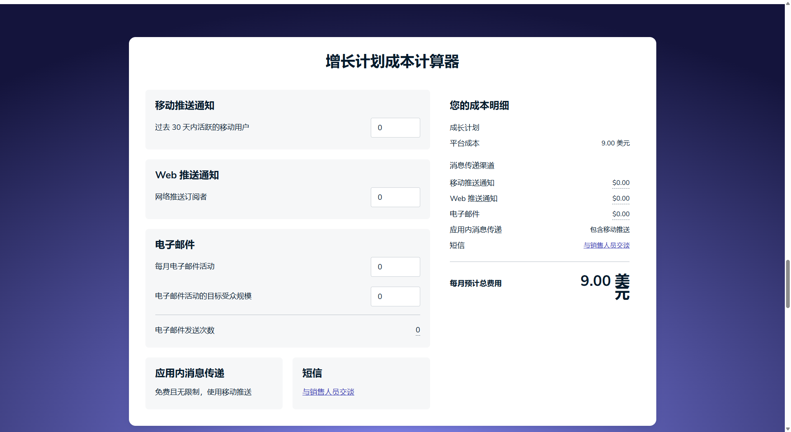
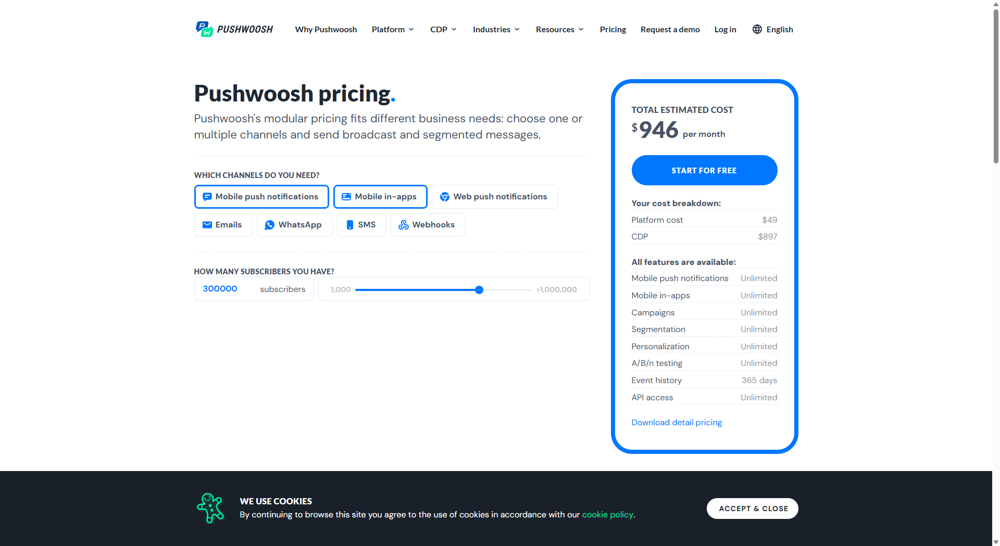

# Web Push调研

> 简介:Web Push 是一种允许网站通过浏览器向用户发送通知的技术，即使用户没有在网站上活动时，也可以推送通知。它通常用于提醒用户有新的消息、更新、活动等信息。这种通知是通过浏览器发送的，而不仅仅是通过原生应用，因此适用于大多数现代浏览器，如 Chrome、Firefox 和 Safari。

## 推送原理

## 优缺点分析

- 优点:
  - 无需用户打开网页,可以在用户没有打开网页的前提下,接收到通知,非常适合活动推广或者是即时提醒,由于调用的是系统级的通知,当用户授权后,通知的优先度很高
  - 支持多浏览器和平台,现代的浏览器大多都支持了Web push,并且支持跨平台
  - 增强与用户的互动,提高网站的留存率和用户参与度
- 缺点
  - 用户必须授权接受通知,而且浏览器只会在一开始的时候请求授权,如果用户拒绝了通知的这个功能,很大概率转换成实际的效益上不明显
  - 推送的信息量有限,只能把有限的活动数据推送给用户一端
  - 频率控制,如果推送频率过高,可能让用户反感

## 实现成本

具体有几个需要成本的地方

1. **基础设施成本**

   > 要搭建一个Web push服务,首先需要考虑我们的需求和独立站流量和用户规模
   >
   > 服务器和数据库上,使用云服务器厂商(Google Cloud,AWS等),这个方面可以根据我们的具体的情况进行部署

2. **推送服务费用**

   **Firebase Cloud Messaging (FCM)**：完全免费，支持无限量的推送通知，但有一些限制，比如推送量过大时可能需要付费或其他条件。

   > 作为 Google 的产品，FCM 与 Firebase 平台的其他服务（如 Firebase Analytics、Firebase Authentication 等）无缝集成，适合已经使用 Firebase 生态的项目。
   >
   > FCM提供无限量的推送通知服务,完全免费
   >
   > 跨平台的支持度很好
   >
   > but
   >
   > **功能相对简单**：FCM 提供的是基础的推送通知服务，虽然可以通过 Firebase Console 配置和发送通知，但功能不如 OneSignal 或 Pushwoosh 强大，缺少一些高级功能，如 A/B 测试、用户分组等。
   >
   > **配置较复杂**：虽然 FCM 是免费的，但配置和集成到应用中需要更多的开发工作，尤其是在多平台支持方面。

   **OneSignal**：免费额度较高，支持基本功能，提供付费计划来解锁高级功能和更高的推送量。

   > free:支持最多 10,000 个推送订阅者，每月限制 1,000,000 个推送。
   >
   > Essential Plan：每月 $9，支持更多高级功能。
   >
   > Pro Plan：custom，支持更多推送数量和个性化设置。
   >
   > 

   >  适用场景
   >
   > 中小型应用，特别是需要跨平台推送和自动化通知功能的项目
   >
   > 需要分析报告和 A/B 测试的开发者

   **Pushwoosh**：提供免费计划，并根据推送数量或功能要求收费。

   相较于 FCM 和 OneSignal，Pushwoosh 的集成过程相对复杂一些，可能需要更多的开发和配置。

   > 支持最多 1,000 个设备订阅，每月最多 1,000 个推送。
   >
   > Esseential Plan: 每月 $61，支持更多设备和推送数量
   >
   > Pro Plan:每月 $946-custom，支持更多的个性化推送、分组和报告分析
   >
   > Enterprise Plan: 定制化价格，适合大规模企业
   >
   > 
   >
   > 适用场景
   >
   > 需要强大功能和个性化推送的企业级应用

   | 特性         | **Firebase Cloud Messaging (FCM)** | **OneSignal**                              | **Pushwoosh**                              |
   | ------------ | ---------------------------------- | ------------------------------------------ | ------------------------------------------ |
   | **平台支持** | Web、iOS、Android                  | Web、iOS、Android、Email、In-App           | Web、iOS、Android、Email、SMS、Smartwatch  |
   | **免费计划** | 完全免费                           | 支持最多 10,000 订阅者，1,000,000  推送/月 | 支持最多 1,000 订阅者，每月最多 1,000 推送 |
   | **高级功能** | 无                                 | A/B 测试、用户分组、报告、自动化推送       | 高级分组、分析报告、定制化推送             |
   | **集成难度** | 较复杂，需手动配置                 | 简单，提供 SDK 和文档                      | 中等，提供定制化 SDK 和 API                |
   | **付费计划** | 无（完全免费                       | 从 $9/月开始                               | 从 $61/月开始                              |
   | **适用场景** | 小型到中型应用                     | 中小型应用，跨平台推送、自动化             | 大型企业应用，需要深度定制和推送优化       |

   

3. **开发成本**

   实现 Web Push 通知需要开发一定的代码来实现订阅、接收推送、展示通知等功能。开发成本包括：

   ​	•**前端开发**：集成 Web Push 通知的代码，包括请求权限、订阅用户、显示通知等。这通常涉及到 JavaScript 和 Service Worker 的使用。

   ​	•**后端开发**：实现推送通知的生成、存储订阅信息、定时发送通知等。这需要处理 Web Push 的推送 API 和数据库操作。

4. **维护成本**

5. **合规性和隐私成本**

   如果在欧盟地区运营这个Web push,可能需要考虑当地的法律法规,需要一定的成本.

## 开发时间周期

1. 需要调研在西欧或者北美(EU,US)站试点开发,可以先考虑做活动信息通知,尝试转换率效果. -前后端各需要1day
1. 运营配置信息,可能需要专门简略通知内容,尽量不超过4Kb -0.5day

## 建议

可以采纳台湾犀牛盾官网一样的做法,使用电子邮件的形式,推送活动信息,因为相对web push的形式,电子邮件在海外比较流行,而且通用于国内的市场,开发成本相比web push肯定要低,而且也有比较成熟的方案.

如果要采用webpush,可以采用FCM的方案用于实验性

